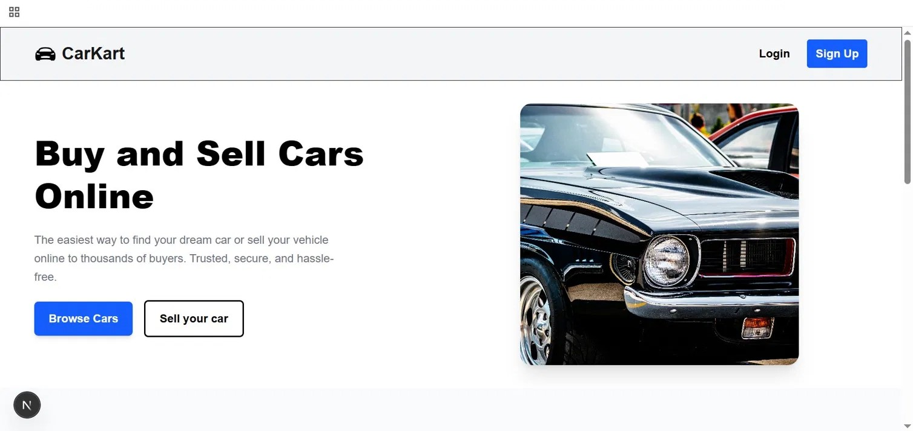
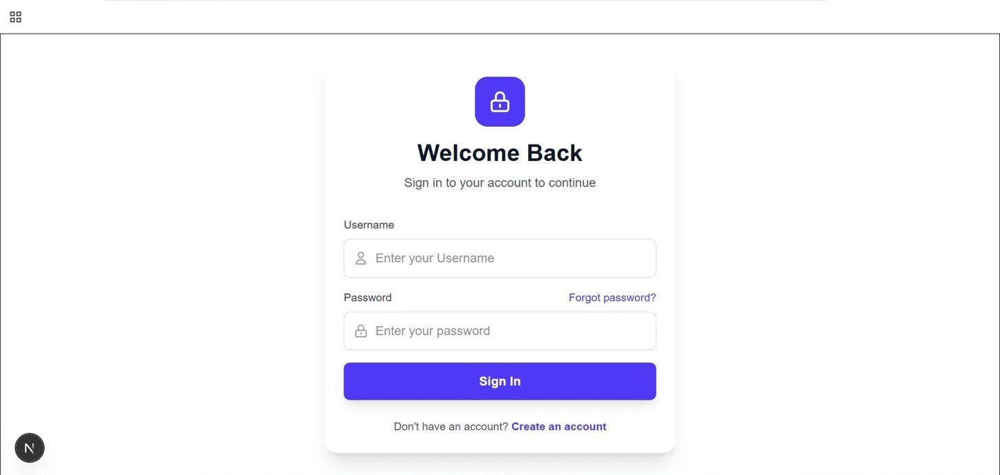
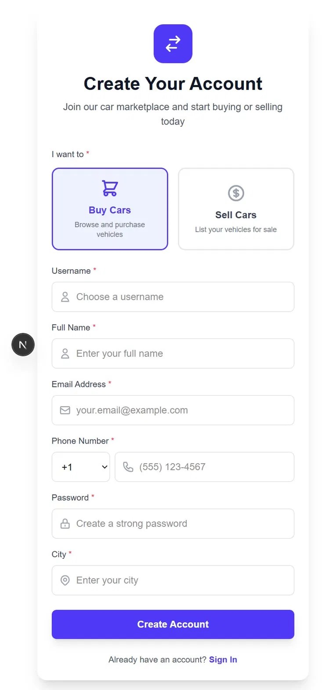
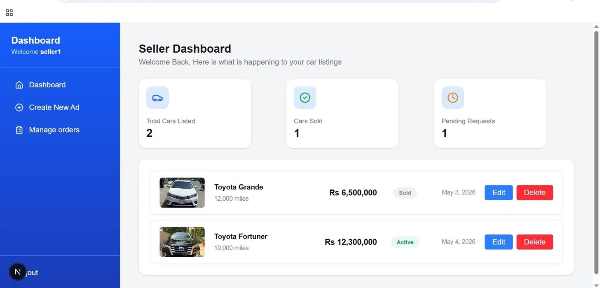
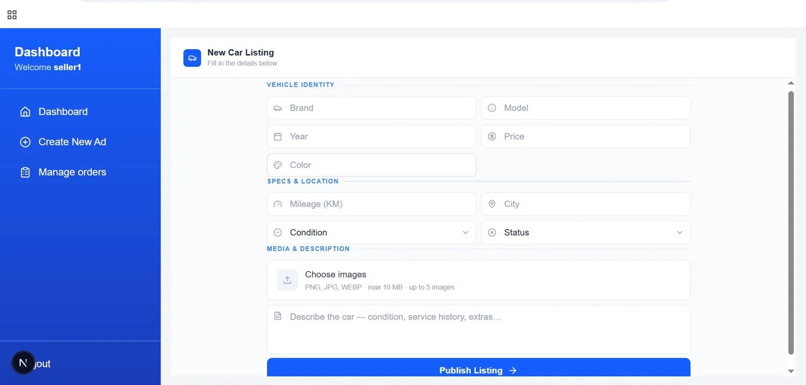
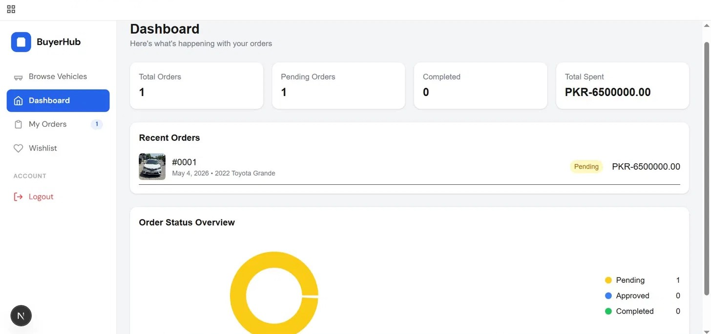
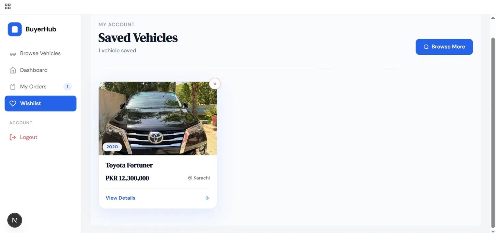

# 🚗 CarKart — Car Marketplace Platform

A full-stack car marketplace where users can register as **Buyers** or **Sellers**, list vehicles, browse listings, manage orders, and track activity through dedicated dashboards.



---

## ✨ Features

### 🧑‍💼 Seller
- Create and publish car listings with images, specs, price, and location
- Edit or delete existing listings
- Manage incoming order requests (approve/reject)
- Track total cars listed, cars sold, and pending requests via dashboard

### 🛒 Buyer
- Browse available car listings with details and images
- Place order requests on vehicles
- Save vehicles to a personal wishlist
- Track orders and spending via dashboard with visual charts

### 🔐 Auth
- Role-based registration (Buyer / Seller) at signup
- JWT-based authentication with session management
- Secure login/logout flow

---

## 📸 Screenshots

### 🏠 Home Page


### 🔐 Login


### 📝 Sign Up


### 📋 Seller Dashboard


### ➕ Create New Car Listing


### 🚘 Browse Vehicles (Buyer)


### 📦 Buyer Orders & Dashboard


---

## 🛠️ Tech Stack

| Layer | Technology |
|---|---|
| Frontend | Next.js, React, Tailwind CSS |
| Backend | Node.js, Express.js |
| Database | MySQL |
| Auth | JWT, Sessions, Cookies |
| API Testing | Postman |

---

## 🚀 Getting Started

### Prerequisites
- Node.js v18+
- MySQL

### Backend Setup
```bash
cd backend
npm install
# Add your .env file (see .env.example)
npm start
```

### Frontend Setup
```bash
cd frontend
npm install
npm run dev
```

Open [http://localhost:3000](http://localhost:3000) in your browser.

---

## 📁 Project Structure

```
CarKart/
├── backend/          # Express.js REST API
│   ├── routes/       # API routes
│   ├── middleware/   # Auth middleware
│   └── db/           # MySQL connection
├── frontend/         # Next.js app
│   ├── app/          # Pages and components
│   └── public/       # Static assets
└── screenshots/      # Project screenshots
```

---

## 👨‍💻 Built By

**Muhammad Uzair Aslam** — [GitHub](https://github.com/Uzair-Aslam-Dev) · [LinkedIn](https://www.linkedin.com/in/uzair-aslam-929694364)

> Built as a collaborative academic project for Database Systems course @ FAST NUCES
